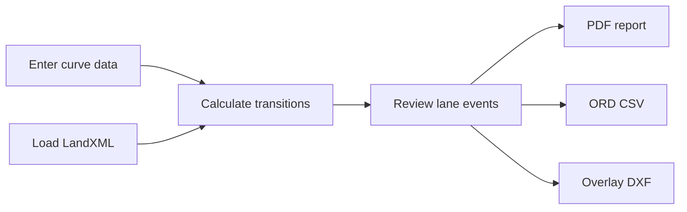

<p align="center">
  
</p>

<p align="center">
  <strong>Roadway superelevation calculations, design review, and CAD-ready exports for Windows and the browser.</strong>
</p>

<p align="center">
  <a href="https://github.com/colewinstead/VeriCivil/releases/latest"></a>
  <a href="https://github.com/colewinstead/VeriCivil/actions/workflows/tests.yml"></a>
  
  
</p>

<p align="center">
  <a href="https://github.com/colewinstead/VeriCivil/releases/latest"><strong>Download for Windows or macOS</strong></a>
  &nbsp;&middot;&nbsp;
  <a href="#quick-start">Run from source</a>
  &nbsp;&middot;&nbsp;
  <a href="#engineering-notes">Engineering notes</a>
</p>

---

## What it does

Superelevation Calculator turns roadway curve inputs and LandXML alignments into review-ready calculations and deliverables. It is designed around practical OpenRoads Designer and MicroStation handoff workflows.

| Calculate | Review | Export |
|:--|:--|:--|
| Versioned MDOT and TDOT criteria profiles | Lane-by-lane slopes and stations | PDF calculation reports |
| Normal crown and full super cases | Project, route, alignment, and curve metadata | ORD-compatible CSV |
| Station equations | LandXML geometry validation | Real-coordinate overlay DXF |
| East/West coordinate transforms | Actionable export warnings | Reusable project JSON |

## Typical workflow



1. Enter curve information manually or load an alignment from LandXML.
2. Review calculated transition stations and signed lane slopes.
3. Save the project for later editing.
4. Export a PDF report, ORD CSV, or CAD overlay DXF.
5. Verify the result in OpenRoads Designer or MicroStation before production use.

## Download

Download the latest Windows executable or native macOS disk image from [GitHub Releases](https://github.com/colewinstead/VeriCivil/releases/latest). Separate macOS builds are provided for Apple Silicon and Intel processors. Desktop applications are distributed as release assets instead of being stored in the source tree.

> [!IMPORTANT]
> This is an engineering aid. Always validate criteria, stationing, coordinate systems, lane naming, and exported geometry against the governing standards and the project design file.

## Quick start

Requires Python 3.11 or newer.

The current application release is **1.4.25** and the calculation-engine release is **1.2.4**. The engine centralizes each MDOT lane transition as one piecewise-linear profile used by diagrams, lookup, QA, and exports. The outside lane runs from zero cross slope to full super, while the inside lane holds normal crown until the SE-3A `X1 = Lr(NC/e)` breakpoint and then rotates linearly to full super. Explicit reverse-curve pairs remove only the intervening tangent runout and require `Tmin = 0.7Lr(exit) + 0.7Lr(entry)`. Each lane retains the applicable standard `e/Lr` rate, joins continuously at an intersection when needed, or holds normal crown until the incoming transition begins. A valid unequal-rate intersection may occur just before PT or just after PC because both points lie within the recorded runoffs; the unchanged full-super stations bound the coordinated profile. A normal-crown hold records only its real start and end control points. A short or invalid pair blocks coordination without changing the independent curve results. See [`docs/MDOT_TRANSITION_MODEL.md`](docs/MDOT_TRANSITION_MODEL.md). These identifiers are defined once in `app_info.py` and are recorded in new project files and PDF reports.

```powershell
git clone https://github.com/colewinstead/VeriCivil.git
Set-Location .\VeriCivil
python -m pip install -r .\requirements.txt
python .\super_app.py
```

## Browser app

The browser app runs the same Python calculation and export modules locally through Pyodide. Project data and LandXML content stay in the browser; no calculation server, account, database, or upload is required. The app can be served as static files from a free static host.

```bash
cd web
npm install
npm run dev
```

Local development defaults to Pro without an account or URL parameter. The calculator's Local test plan selector can switch to Free or Team for testing; explicit `?entitlement=free` overrides remain supported. The hosted website continues to use account entitlements.

Create a production build with `npm run build`. The deployable files are written to `web/dist`. The build stages the shared Python modules from the repository, so calculation and export changes are made once and used by both the desktop and browser applications.

The first browser visit downloads the Python runtime and scientific/export packages. After that initial load, calculations and file exports occur on the user's device. Saved `.superelevation.json` project files are portable between the desktop and browser versions.

## Export formats

### PDF report

Produces a formatted calculation report using the same curve objects shown in the desktop interface.

### ORD CSV

Writes Bentley's documented superelevation import columns:

```text
SuperelevationLane,Station,CrossSlope,PivotAbout,PointType,TransitionType,NonLinearCurveLength
```

Station labels account for LandXML station equations and advance through ORD regions such as `R2`, `R3`, and `R4`.

### Overlay DXF

Creates a graphics overlay in real project coordinates from LandXML line and circular-arc geometry. It includes:

- lane-specific leaders and signed slope labels
- PC and PT station callouts
- curve names, direction, and radius
- collision-aware label placement
- MDOT-oriented levels, colors, weights, and text styling
- US survey foot declarations and optional East/West zone transformation

The DXF is a graphics handoff, not a native Bentley civil model.

## LandXML support

| Supported | Detected with warning |
|:--|:--|
| Alignment name and start station | Spiral geometry |
| Linear units | Unsupported or incomplete geometry |
| Line geometry | Ambiguous displayed stations |
| Circular arcs | Out-of-range export stations |
| Station equations | Missing coordinate context |

## Engineering notes

> [!CAUTION]
> Calculations record the selected criteria profile and source revision. The default `mdot-rdsd-2026-04-22` profile preserves the existing MDOT behavior. The `tdot-rd11-2026-04-30` profile uses TDOT RD11-LR-1's desirable 4% urban table, RD11-LR-2's desirable 8% rural table, and RD11-SE-1 transition equations for undivided-roadway lane events. It also records the RD11 typical-section catalog as supporting design criteria; width, grade, sight-distance fields, and divided-roadway lane geometry are not automatically modeled. The licensed professional responsible for the project must independently verify criteria, applicability, inputs, results, and deliverables. See [`docs/PAID_PILOT_READINESS.md`](docs/PAID_PILOT_READINESS.md), [`docs/COMMERCIAL_READINESS.md`](docs/COMMERCIAL_READINESS.md), and [`docs/PILOT_OPERATIONS.md`](docs/PILOT_OPERATIONS.md).

<details>
<summary><strong>ORD import checklist</strong></summary>

Before production use, verify that:

- the target superelevation section and lanes already exist
- lane names match between the application and ORD
- station formatting matches the design file
- station equations resolve to the intended alignment region
- transition type, pivot settings, and nonlinear lengths match project criteria

</details>

<details>
<summary><strong>Lane slope sign convention</strong></summary>

- Normal crown: both lanes negative
- Right-hand curve: left lane positive, right lane negative through full super
- Left-hand curve: left lane negative, right lane positive through full super
- Positive display values always include an explicit `+`

</details>

<details>
<summary><strong>DXF and MicroStation checks</strong></summary>

Always verify reference units, working units, origin, coincident placement, rotation, stationing assumptions, text scale, and readability in ORD or MicroStation.

LandXML points are interpreted as Northing/Easting and written to CAD as X=Easting and Y=Northing. Coordinate transformation requires the correct MDOT MS83/2011 East or West zone selection.

</details>

## Project structure

| File | Purpose |
|:--|:--|
| [`super_app.py`](super_app.py) | Desktop application entry point |
| [`super_service.py`](super_service.py) | Platform-neutral calculation, project, and export service |
| [`Super.py`](Super.py) | Core superelevation calculation path |
| [`super_landxml.py`](super_landxml.py) | LandXML parsing and station geometry |
| [`super_exports.py`](super_exports.py) | Shared lane-event and export logic |
| [`super_dxf.py`](super_dxf.py) | Overlay DXF generation |
| [`super_pdf.py`](super_pdf.py) | PDF calculation reports |
| [`super_project.py`](super_project.py) | Project save/load support |
| [`app_info.py`](app_info.py) | Authoritative application and engine versions |
| [`criteria_info.py`](criteria_info.py) | Criteria/source traceability metadata |
| [`tdot_criteria.py`](tdot_criteria.py) | Versioned TDOT RD11 radius, gradient, and lane-factor tables |
| [`app_logging.py`](app_logging.py) | Per-user rotating diagnostic logging |
| [`web`](web) | Browser-only React interface and Pyodide worker |

## Project-file compatibility

Projects use JSON schema version 5. The application migrates schema v1 through v4 files in memory and preserves older calculation provenance as `legacy-unversioned` when needed. It refuses project files created by a newer schema rather than silently discarding unknown data. Desktop saves use a temporary file and atomic replacement to reduce corruption risk.

Schema v4 introduced embedded LandXML text, original filename, and SHA-256 integrity. Schema v5 adds explicit, adjacent, disjoint `reverse_curve_pairs`. Opening and resaving an older project upgrades its container to schema v5; it preserves recorded results and provenance and does not silently recalculate them with the current engine.

## Logging and troubleshooting

Unexpected errors and failed LandXML, project, PDF, CSV, and DXF operations are written to a rotating local log. Error dialogs offer to open the log folder. Logs are kept on the user's computer and are not uploaded automatically.

| Platform | Log folder |
|:--|:--|
| Windows | `%LOCALAPPDATA%\SuperelevationCalculator\Logs` |
| macOS | `~/Library/Logs/SuperelevationCalculator` |
| Linux | `$XDG_STATE_HOME/superelevation-calculator/logs` or `~/.local/state/...` |

When reporting a problem, reproduce it with sanitized data if possible, then send the relevant `superelevation.log` excerpt. Logs can contain local file paths and exception details, so review them before sharing.

## Windows build

Build the portable executable on a clean Windows x64 machine with Python 3.11:

```powershell
Set-ExecutionPolicy -Scope Process Bypass
.\scripts\build_windows.ps1
```

The script installs the declared dependencies and PyInstaller, removes old build output, generates Windows version resources from `app_info.py`, builds `dist\SuperElevation.exe`, and writes `dist\SHA256SUMS.txt`.

## macOS build

Build the native application and disk image on macOS 15 or newer:

```bash
./scripts/build_macos.sh
```

The script detects Apple Silicon or Intel, packages `Superelevation Calculator.app`, creates the matching DMG, verifies its version and architecture, and writes a SHA-256 checksum file. GitHub Actions builds both architectures for each release.

### Automatic GitHub releases

Every pull request targeting `main` must increase `APP_VERSION` in `app_info.py` beyond the latest GitHub release. After that pull request is merged and all release jobs pass, GitHub publishes a full release tagged `vMAJOR.MINOR.PATCH` with the Windows executable, Apple Silicon and Intel macOS disk images, checksums, and the matching browser build archive. Because every merge becomes a user-facing release, do not merge documentation-only or intermediate work without assigning it the next version.

The automated Windows executable is currently unsigned. Signed pilot releases still require the private Windows signing computer, `scripts\build_windows.ps1 -BuildInstaller -Sign`, `scripts\verify_windows_release.ps1`, and the release acceptance checklist. Publishing the browser archive to the existing ChatGPT Site remains a separate `Ship main` step in Codex.

### Desktop update checks

Each desktop launch makes one background HTTPS request to GitHub's public latest-release endpoint after the application window opens. The check sends no project, LandXML, calculation, file-path, or telemetry data. It remains silent when the installed version is current or when GitHub cannot be reached.

When a newer release is available, the application displays the current and latest versions and offers the matching direct download: the Windows executable, Apple Silicon DMG, or Intel DMG. The browser performs the download, and installation or replacement remains manual. The application never silently downloads, installs, or replaces software.

To also build the optional per-user installer, install Inno Setup 6 and run:

```powershell
.\scripts\build_windows.ps1 -BuildInstaller
```

### Free pilot signing and checksums

For the controlled pilot only, create a self-signed code-signing certificate on the private Windows build computer:

```powershell
.\scripts\new_pilot_signing_certificate.ps1
```

The private keys stay in that Windows user's certificate store. The script exports only the public pilot root and public signing certificates to `dist`. Do not upload or distribute a `.pfx` file or any private-key export.

Build and sign the executable and installer, then generate SHA-256 checksums over the final signed files:

```powershell
.\scripts\build_windows.ps1 -BuildInstaller -Sign
```

Verify every checksum, both Authenticode signatures, and the private certificate chain without changing the computer's trust settings:

```powershell
.\scripts\verify_windows_release.ps1
```

Self-signing does not create public Windows reputation. A pilot engineer must independently confirm the public certificate thumbprints with Cole Winstead and explicitly trust them for their Windows account. This command must be run in a normal interactive PowerShell window so Windows can display its root-trust confirmation; it cannot be completed through a headless SSH session:

```powershell
.\scripts\install_pilot_public_certificate.ps1 `
    -RootCertificatePath .\Cole-Winstead-Pilot-Root.cer `
    -SigningCertificatePath .\Cole-Winstead-Pilot-Code-Signing.cer `
    -AcknowledgePilotTrust
```

The engineer should then compare the installer's SHA-256 value with `SHA256SUMS.txt`. Browser or Microsoft Defender SmartScreen warnings may still appear because this is not a publicly trusted commercial certificate. Customer IT approval is recommended before installing a private trust certificate.

The build script ignores nonfunctional Microsoft Store Python aliases and also checks Inno Setup's standard per-user and Program Files locations. For nonstandard installations, pass explicit paths:

```powershell
.\scripts\build_windows.ps1 -BuildInstaller `
    -PythonPath "C:\Path\To\python.exe" `
    -InnoSetupCompiler "C:\Path\To\ISCC.exe"
```

The installer definition is in `packaging\Superelevation.iss`. A Windows build, installer install/uninstall, code signature, checksum, and SmartScreen behavior must be validated on the pilot Windows images before distribution.

Before paid distribution, review the [current Inno Setup commercial-license guidance](https://jrsoftware.org/isorder.php) and record the licensing decision with the other third-party notices.

## Release procedure

Follow [`docs/RELEASE_CHECKLIST.md`](docs/RELEASE_CHECKLIST.md). In summary: approve engineering traceability, update `app_info.py`, run all tests, build on Windows, exercise every file workflow from the built executable, sign the EXE/installer, verify signatures and checksums on a clean pilot machine, archive the validation evidence, and publish immutable release assets with release notes. The launch-time checker only notifies users and opens a browser download; pilot installation and rollback remain manual and controlled.

## Tests

```powershell
python -m pip install -r .\requirements.txt
python -m unittest -v
```

The browser parity suite builds the production app, renders its shell, runs the shared Python engine in Pyodide, checks an approved numeric vector, and generates CSV, PDF, and DXF outputs:

```bash
cd web
npm install
npm test
```

The test suite covers calculation sharing, station formatting, lane signs, LandXML parsing, coordinate transforms, project persistence, ORD CSV mapping, and DXF generation.

It also covers version/criteria metadata, rotating logs, project schema migration/refusal, PDF traceability, Windows version-resource generation, and a synthetic end-to-end LandXML/CSV/PDF/DXF/project workflow.

## Contributing

Bug reports and focused pull requests are welcome. When reporting an export problem, include the expected stationing/sign behavior and a minimal, non-sensitive reproduction case.

## License

No open-source license has been selected yet. The source is publicly visible, but reuse and redistribution rights are not granted unless a license is added.
