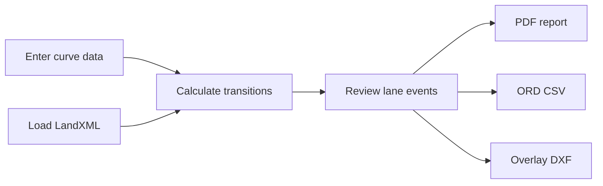

<p align="center">
  
</p>

<p align="center">
  <strong>Browser-based roadway superelevation calculations, design review, and CAD-ready exports.</strong>
</p>

<p align="center">
  <a href="https://github.com/colewinstead/VeriCivil/actions/workflows/tests.yml"></a>
</p>

<p align="center">
  <a href="https://vericivil.com"><strong>Open the live VeriCivil calculator</strong></a>
  &nbsp;&middot;&nbsp;
  <a href="#quick-start">Run from source</a>
  &nbsp;&middot;&nbsp;
  <a href="#engineering-notes">Engineering notes</a>
</p>

---

## What it does

Superelevation Calculator turns roadway curve inputs and LandXML alignments into review-ready calculations and deliverables. It is designed around practical OpenRoads Designer and MicroStation handoff workflows.

| Calculate | Review | Export |
|:--|:--|:--|
| Versioned MDOT and TDOT criteria profiles | Lane-by-lane slopes and stations | PDF calculation reports |
| Normal crown and full super cases | Project, route, alignment, and curve metadata | ORD-compatible CSV |
| Station equations | LandXML geometry validation | Real-coordinate overlay DXF |
| East/West coordinate transforms | Actionable export warnings | Reusable project JSON |

## Typical workflow


```mermaid
flowchart LR
    A["Enter curve data"] --> B["Calculate transitions"]
    X["Load LandXML"] --> B
    B --> C["Review lane events"]
    C --> D["PDF report"]
    C --> E["ORD CSV"]
    C --> F["Overlay DXF"]
```

1. Enter curve information manually or load an alignment from LandXML.
2. Review calculated transition stations and signed lane slopes.
3. Save the project for later editing.
4. Export a PDF report, ORD CSV, or CAD overlay DXF.
5. Verify the result in OpenRoads Designer or MicroStation before production use.

## Live app

Use the [live VeriCivil browser calculator](https://vericivil.com), the current public version of VeriCivil.

> [!IMPORTANT]
> This is an engineering aid. Always validate criteria, stationing, coordinate systems, lane naming, and exported geometry against the governing standards and the project design file.

## Quick start

Open [vericivil.com](https://vericivil.com) to use the calculator in your browser. No local Python installation is required to use the live app.

To run the browser app from source, install Python 3.11+ and Node.js 22.13+. Python stages the shared engine files; the browser installs its own calculation packages through Pyodide. Installing `requirements-lock.txt` is only needed for native Python calculations and tests.

Clone the repository once if you do not already have it:

```bash
git clone https://github.com/colewinstead/VeriCivil.git
```

**macOS/Linux (Terminal, zsh or bash):**

```bash
cd VeriCivil/web
npm ci --ignore-scripts
npm run dev
```

**Windows (PowerShell):**

```powershell
Set-Location .\VeriCivil\web
npm ci --ignore-scripts
npm run dev
```

If your terminal is already in the repository root, use `cd web` on macOS/Linux or `Set-Location .\web` in PowerShell. Run npm commands from `web`, where `package.json` and `package-lock.json` live. Keep the terminal running and open the local URL printed by the development server.

Startup uses `python3` on macOS/Linux and `python` on Windows; the selected executable must be on PATH. A shell alias alone is not sufficient for npm. `Set-Location` and Windows backslash paths are PowerShell syntax and will fail in macOS Terminal.

## Browser app

The browser app runs the shared Python calculation and export modules locally through Pyodide. Calculation inputs, project data, and LandXML content are processed in the browser tab and are not automatically uploaded. The hosted site also provides server-side sign-in, plan entitlements, billing, and anonymous usage analytics.

Local development defaults to Pro without an account or URL parameter. The calculator's Local test plan selector can switch to Free or Team for testing; explicit `?entitlement=free` overrides remain supported. The hosted website continues to use account entitlements.

Create a production build with `npm run build` from `web`. The output is written to `web/dist`, including browser assets and a Cloudflare Workers-compatible server runtime for the hosted account and billing routes. The build stages the authoritative shared Python modules from the repository; do not edit the staged copies.

The first browser visit downloads the Python runtime and scientific/export packages. After that initial load, calculations and file exports occur on the user's device. Save and reopen `.superelevation.json` project files locally through the browser interface.

## Export formats

### PDF report

Produces a formatted calculation report using the same calculated curve data shown in the browser interface.

### ORD CSV

Writes Bentley's documented superelevation import columns:

```text
SuperelevationLane,Station,CrossSlope,PivotAbout,PointType,TransitionType,NonLinearCurveLength
```

Station labels account for LandXML station equations and advance through ORD regions such as `R2`, `R3`, and `R4`.

### Overlay DXF

Creates a graphics overlay in real project coordinates from LandXML line and circular-arc geometry. It includes:

- lane-specific leaders and signed slope labels
- PC and PT station callouts
- curve names, direction, and radius
- collision-aware label placement
- MDOT-oriented levels, colors, weights, and text styling
- US survey foot declarations and optional East/West zone transformation

The DXF is a graphics handoff, not a native Bentley civil model.

## LandXML support

| Supported | Detected with warning |
|:--|:--|
| Alignment name and start station | Spiral geometry |
| Linear units | Unsupported or incomplete geometry |
| Line geometry | Ambiguous displayed stations |
| Circular arcs | Out-of-range export stations |
| Station equations | Missing coordinate context |

## Engineering notes

The authoritative application and calculation-engine versions are defined in [`app_info.py`](app_info.py). The engine centralizes each MDOT lane transition as one piecewise-linear profile used by diagrams, lookup, QA, and exports. The outside lane runs from zero cross slope to full super, while the inside lane holds normal crown until the SE-3A `X1 = Lr(NC/e)` breakpoint and then rotates linearly to full super. Explicit reverse-curve pairs remove only the intervening tangent runout and require `Tmin = 0.7Lr(exit) + 0.7Lr(entry)`. Each lane retains the applicable standard `e/Lr` rate, joins continuously at an intersection when needed, or holds normal crown until the incoming transition begins. A valid unequal-rate intersection may occur just before PT or just after PC because both points lie within the recorded runoffs; the unchanged full-super stations bound the coordinated profile. A normal-crown hold records only its real start and end control points. A short or invalid pair blocks coordination without changing the independent curve results. See [`docs/MDOT_TRANSITION_MODEL.md`](docs/MDOT_TRANSITION_MODEL.md). These identifiers are defined once in `app_info.py` and are recorded in new project files and PDF reports.

> [!CAUTION]
> Calculations record the selected criteria profile and source revision. The default `mdot-rdsd-2026-04-22` profile preserves the existing MDOT behavior. The `tdot-rd11-2026-04-30` profile uses TDOT RD11-LR-1's desirable 4% urban table, RD11-LR-2's desirable 8% rural table, and RD11-SE-1 transition equations for undivided-roadway lane events. It also records the RD11 typical-section catalog as supporting design criteria; width, grade, sight-distance fields, and divided-roadway lane geometry are not automatically modeled. The licensed professional responsible for the project must independently verify criteria, applicability, inputs, results, and deliverables. See [`docs/PAID_PILOT_READINESS.md`](docs/PAID_PILOT_READINESS.md), [`docs/COMMERCIAL_READINESS.md`](docs/COMMERCIAL_READINESS.md), and [`docs/PILOT_OPERATIONS.md`](docs/PILOT_OPERATIONS.md).

The `aashto-green-book-2018-2019-10` profile supports automatic table-row selection and NC/RC thresholds through a locally imported, corrected workbook; equal-width fixed-pivot sections; and established clothoid transitions. Green Book §3.3.5 selects the first qualifying row in increasing rate order using a tabulated radius at or below the actual radius; interpolation is unnecessary. Results record the selected row and radius. It does not ship the copyrighted table grids, evaluate continuous Method 5 equations, or construct new alignments. Circular runoff placement is an explicit project input; spiral runout may be on tangent or in spiral. Short spirals block calculation, and longer zero-crown holds require acknowledgement and drainage review. See [AASHTO scope, sources, and acceptance limits](docs/AASHTO_2018.md) before use.

LandXML reverse-curve notices appear only when opposing curves have overlapping calculated runoff/runout. Before both curves are added, the shared Python engine can provide a labelled spacing preview from the current design inputs; incomplete or unsupported inputs leave the spacing unchecked. Corridor QA and PDF record the overlap interval, available spacing, current independent transition demand, and a recommendation for sufficient tangent or combined spiral/tangent space. Constant-slope holds do not add transition demand. This demand is not a universal agency minimum. Actual eligible MDOT pairs may be linked explicitly; AASHTO/TDOT overlaps require engineering review. Detection does not modify horizontal geometry or shorten transitions.

<details>
<summary><strong>ORD import checklist</strong></summary>

Before production use, verify that:

- the target superelevation section and lanes already exist
- lane names match between the application and ORD
- station formatting matches the design file
- station equations resolve to the intended alignment region
- transition type, pivot settings, and nonlinear lengths match project criteria

</details>

<details>
<summary><strong>Lane slope sign convention</strong></summary>

- Normal crown: both lanes negative
- Right-hand curve: left lane positive, right lane negative through full super
- Left-hand curve: left lane negative, right lane positive through full super
- Positive display values always include an explicit `+`

</details>

<details>
<summary><strong>DXF and MicroStation checks</strong></summary>

Always verify reference units, working units, origin, coincident placement, rotation, stationing assumptions, text scale, and readability in ORD or MicroStation.

LandXML points are interpreted as Northing/Easting and written to CAD as X=Easting and Y=Northing. Coordinate transformation requires the correct MDOT MS83/2011 East or West zone selection.

</details>

## Project structure

| File | Purpose |
|:--|:--|
| [`super_service.py`](super_service.py) | Platform-neutral calculation, project, and export service |
| [`Super.py`](Super.py) | Core superelevation calculation path |
| [`super_landxml.py`](super_landxml.py) | LandXML parsing and station geometry |
| [`super_exports.py`](super_exports.py) | Shared lane-event and export logic |
| [`super_dxf.py`](super_dxf.py) | Overlay DXF generation |
| [`super_pdf.py`](super_pdf.py) | PDF calculation reports |
| [`super_project.py`](super_project.py) | Project save/load support |
| [`app_info.py`](app_info.py) | Authoritative application and engine versions |
| [`criteria_info.py`](criteria_info.py) | Criteria/source traceability metadata |
| [`tdot_criteria.py`](tdot_criteria.py) | Versioned TDOT RD11 radius, gradient, and lane-factor tables |
| [`web`](web) | Browser-only React interface and Pyodide worker |

## Project-file compatibility

Projects use JSON schema version 5. The application migrates schema v1 through v4 files in memory and preserves older calculation provenance as `legacy-unversioned` when needed. It refuses project files created by a newer schema rather than silently discarding unknown data.

Schema v4 introduced embedded LandXML text, original filename, and SHA-256 integrity. Schema v5 adds explicit, adjacent, disjoint `reverse_curve_pairs`. Opening and resaving an older project upgrades its container to schema v5; it preserves recorded results and provenance and does not silently recalculate them with the current engine.

## Troubleshooting

For local startup, `ENOENT ... package.json` or an `npm ci` missing-lockfile error usually means the terminal is outside `web`. On macOS, `Set-Location` is not a zsh command; use the macOS quick-start commands above.

If a macOS native-binding error includes “different Team IDs,” check `command -v node`. A Node executable embedded in another signed application can reject the bundler's native module. Use a standard Node installation. On Apple Silicon Macs with Node already installed by Homebrew, run `PATH="/opt/homebrew/bin:$PATH" npm run dev` from `web` to select it for that command.

When reporting a problem, include the browser and operating system, application and engine versions, selected criteria profile, expected behavior, and a minimal reproduction using non-sensitive data. Browser developer-console messages can help diagnose loading and export errors. Review any console output before sharing it.

## Browser releases

Documentation-only changes (`.md`, `.rst`, and license files) pass the version check without a version bump and do not create a release. Changes to application code, calculation data, tests, dependencies, builds, or workflows must increase `APP_VERSION` in `app_info.py` beyond the latest GitHub release, including when combined with documentation edits. After those changes merge and all release jobs pass, GitHub publishes a release tagged `vMAJOR.MINOR.PATCH` with the browser build archive.

Before a browser release, run the Python tests, TypeScript check, lint, production build tests, and Pyodide parity checks. GitHub publishes the browser archive after the release workflow succeeds. Publishing that release to the existing live Site is a separate `Ship main` step; reuse the Site identified by `web/.openai/hosting.json`.

## Tests

```powershell
python -m pip install -r .\requirements-lock.txt
python -m unittest -v
```

The browser parity suite builds the production app, renders its shell, runs the shared Python engine in Pyodide, checks an approved numeric vector, and generates CSV, PDF, and DXF outputs:

```bash
cd web
npm ci --ignore-scripts
npm exec tsc -- --noEmit
npm run lint
npm test
```

The test suite covers calculation sharing, station formatting, lane signs, LandXML parsing, coordinate transforms, project persistence, ORD CSV mapping, and DXF generation.

It also covers version/criteria metadata, project schema migration/refusal, PDF traceability, release-change classification, and a synthetic end-to-end LandXML/CSV/PDF/DXF/project workflow.

## Contributing

Bug reports and focused pull requests are welcome. When reporting an export problem, include the expected stationing/sign behavior and a minimal, non-sensitive reproduction case.

## License

This project is licensed under the [MIT License](LICENSE). Copyright (c) 2026 Cole Winstead. See `LICENSE` for the full terms. Third-party dependencies retain their own licenses.
